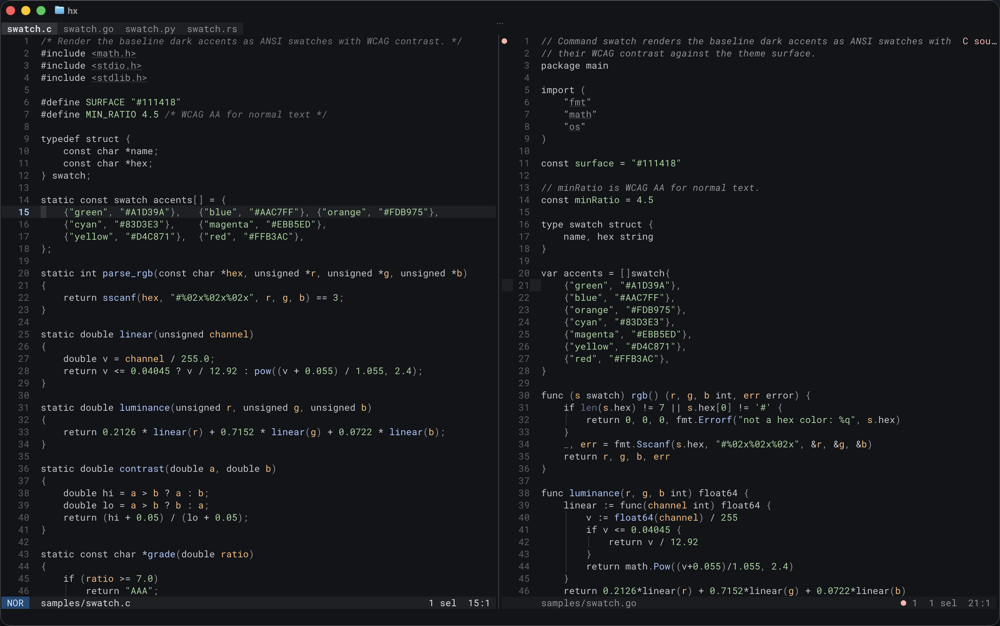
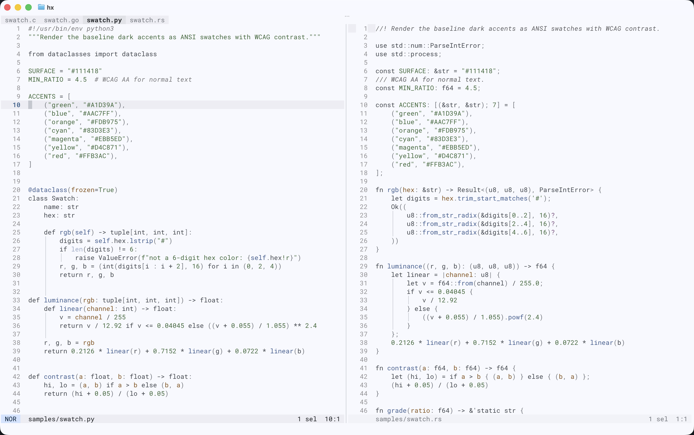

# baseline-themes

baseline is a pair of matched dark/light themes for a limited set of terminal
and Text User Interface (TUI) applications.

Built using Material Design 3 tonal palettes, the design objective is
comfortably readable, all day long. Every accent is sampled at a single tone
per mode (80 dark, 40 light), so all highlights carry identical contrast weight:
~10.8:1 on the dark surface, ~6.2:1 on the light.

Currently supported — each directory holds the theme files and a README with
install notes:

**Terminals**

- [Ghostty](https://ghostty.org) — the reference; follows OS appearance and
  reports it to applications ([setup](ghostty/))
- [foot](https://codeberg.org/dnkl/foot) — reports light/dark to applications;
  theme selection is static ([setup](foot/))
- [Alacritty](https://alacritty.org) — static; live-reload enables a
  symlink-flip switch ([setup](alacritty/))
- [Ptyxis](https://gitlab.gnome.org/chergert/ptyxis) — single dual-mode
  palette; follows the GNOME desktop style ([setup](ptyxis/))

GNOME Console (kgx) is intentionally unthemeable; gnome-terminal requires
dconf profile dumps and is not provided.

**Applications**

- [Helix](https://helix-editor.com), a post-modern editor. The Helix baseline
  features minimal highlighting: constants, strings, functions, parameters,
  and little else — keywords, operators, and variables stay at the default
  foreground, and punctuation recedes. ([setup](helix/))
- [Neovim](https://neovim.io) — the same baseline Helix philosophy, LSP semantic tokens aligned. ([setup](nvim/))
- [Vim](https://www.vim.org) — a reduced rendering for classic syntax groups, because Vim ships everywhere. ([setup](vim/))
- [lazygit](https://github.com/jesseduffield/lazygit), a simple terminal UI
  for git commands. ([setup](lazygit/))

**Libraries**

- [Chroma](https://github.com/alecthomas/chroma), a syntax highlighter for
  Go — styles for code blocks rendered by your own applications.
  ([setup](chroma/))

## Samples

Parallel implementations of one example program across Python, Go, Rust,
Bash, C, and TypeScript, for judging how baseline renders common syntax
in each — see [samples/](samples/).

## Design

The light palette is derived from the dark theme's tonal palettes via
[material-color-utilities](https://github.com/material-foundation/material-color-utilities),
sampled at MD3 light-scheme tones. Terminal ANSI brights are tone 90 (dark)
and tone 30 (light) — on a light surface, darker ink is emphasis. The
error/red families use canonical MD3 chroma, as tone-80 reds are
gamut-clipped and their true chroma is unrecoverable from samples.

Contrast was measured against opaque surfaces; terminal background
translucency dilutes it unpredictably and is not recommended with these
palettes.

## License

MIT
